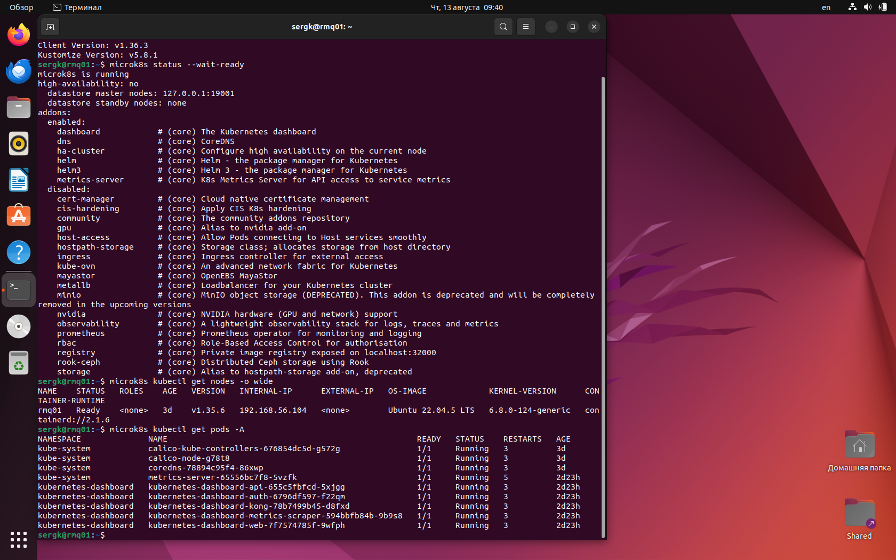
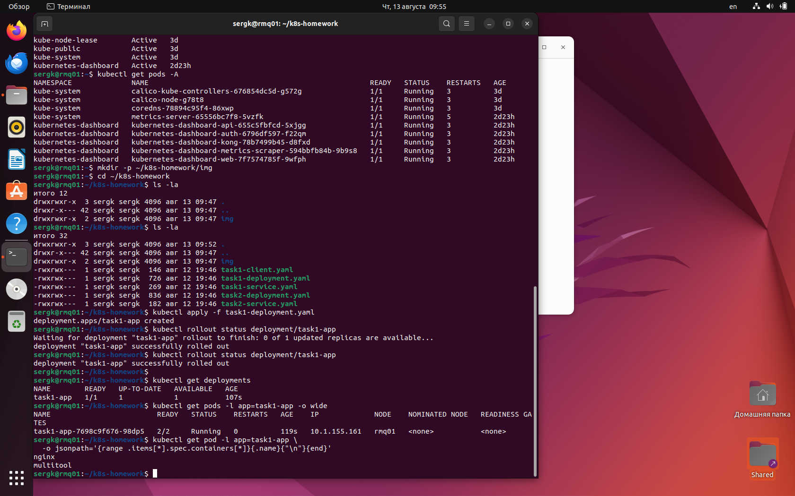
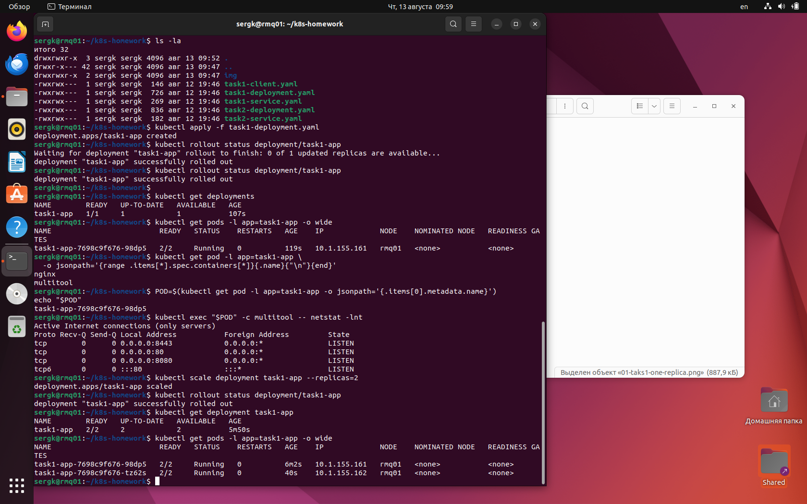
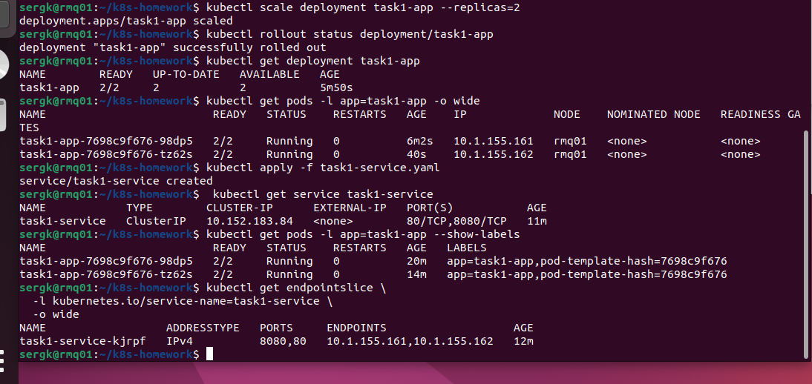
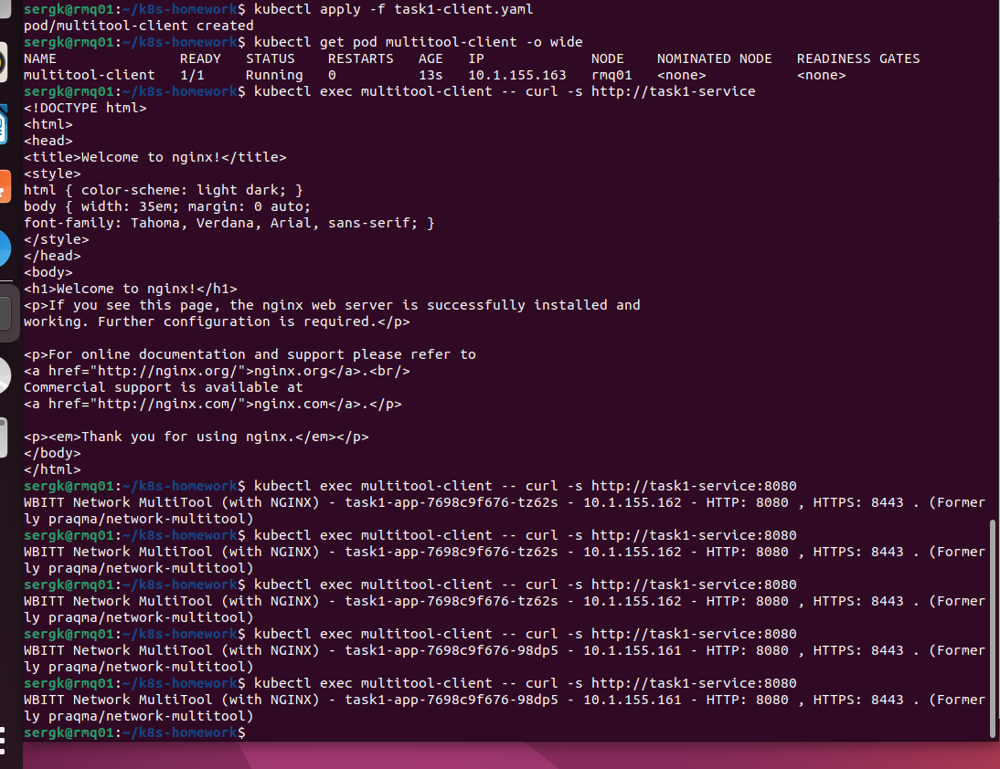
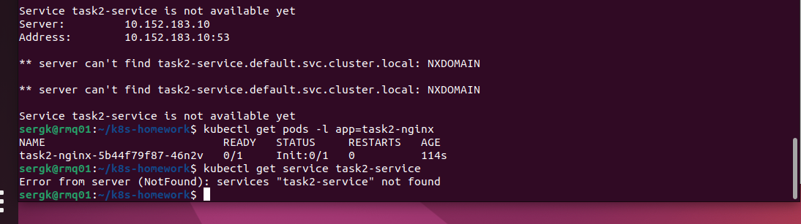
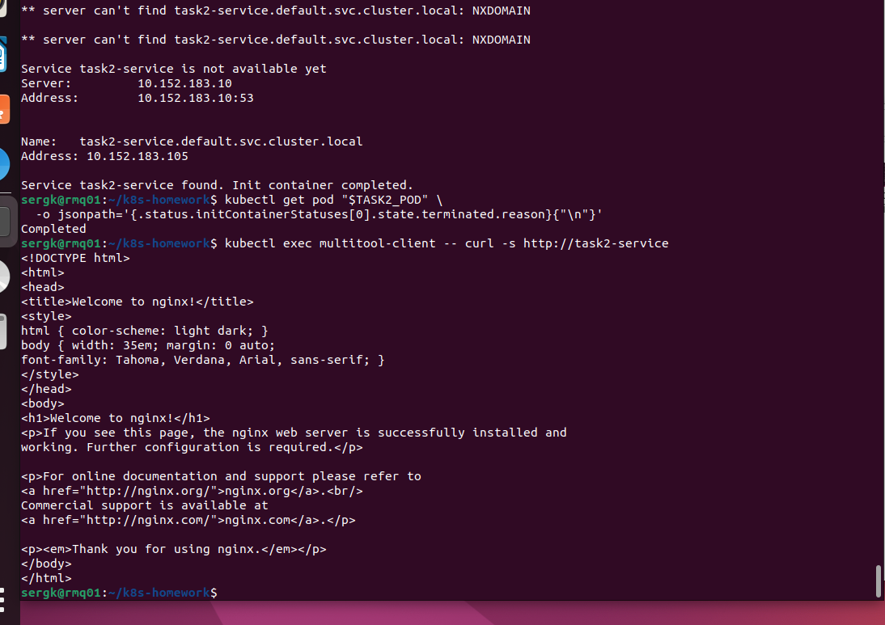
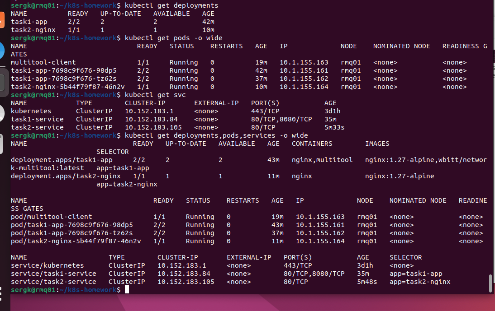

# Домашнее задание к занятию «Запуск приложений в K8S»

## Цель работы

В существующей тестовой среде Kubernetes развернуть приложения с несколькими контейнерами, выполнить масштабирование Deployment, организовать доступ к репликам через Service и продемонстрировать работу Init-контейнера.

---

## Исходная инфраструктура

Для выполнения этого домашнего задания используется **только первая виртуальная машина** из предыдущей работы.

| Параметр | Значение |
|---|---|
| ОС | Ubuntu 22.04 Jammy |
| Kubernetes | MicroK8s |
| ОЗУ | 4 ГБ |
| CPU | 2 vCPU |
| Диск | 20 ГБ |
| NAT-интерфейс `enp0s3` | `10.0.2.15/24` |
| Host-only интерфейс `enp0s8` | `192.168.56.104/24` |

---

# 0. Подготовка виртуальной машины

## 0.1. Проверка MicroK8s

Проверяем состояние MicroK8s:

```bash
microk8s status --wait-ready
```

Проверяем Kubernetes-ноду:

```bash
microk8s kubectl get nodes -o wide
```

Проверяем системные Pod:

```bash
microk8s kubectl get pods -A
```

### Скриншот 



---

# 0.2 Подготовка каталога домашнего задания

Создаём рабочий каталог:

```bash
mkdir -p ~/k8s-homework/img
cd ~/k8s-homework
```

Структура репозитория:

```text
k8s-homework/
├── README.md
├── task1-deployment.yaml
├── task1-service.yaml
├── task1-client.yaml
├── task2-deployment.yaml
├── task2-service.yaml
└── img/
```

Манифесты:

- [task1-deployment.yaml](task1-deployment.yaml)
- [task1-service.yaml](task1-service.yaml)
- [task1-client.yaml](task1-client.yaml)
- [task2-deployment.yaml](task2-deployment.yaml)
- [task2-service.yaml](task2-service.yaml)

---

# Задание 1. Создать Deployment и обеспечить доступ к репликам приложения из другого Pod

1. Создать Deployment приложения, состоящего из двух контейнеров — nginx и multitool. Решить возникшую ошибку.
2. После запуска увеличить количество реплик работающего приложения до 2.
3. Продемонстрировать количество подов до и после масштабирования.
4. Создать Service, который обеспечит доступ до реплик приложений из п.1.
5. Создать отдельный Pod с приложением multitool и убедиться с помощью curl, что из пода есть доступ до приложений из п.1.

## Решение 1

## 1.0 Почему возникает ошибка при запуске двух контейнеров

По условию Deployment должен содержать два контейнера:

1. `nginx`;
2. `multitool`.

Обычный `nginx` слушает TCP-порт:

```text
80
```

Образ `wbitt/network-multitool` также содержит nginx и по умолчанию слушает:

```text
80
443
```

Все контейнеры внутри **одного Kubernetes Pod используют общий network namespace**:

- имеют общий IP-адрес Pod;
- используют одно пространство TCP/UDP-портов;
- могут обращаться друг к другу через `localhost`.

Поэтому два процесса внутри одного Pod не могут одновременно слушать один и тот же адрес/порт `0.0.0.0:80`.


Для `network-multitool` необходимо передать переменные окружения:

```yaml
HTTP_PORT: "8080"
HTTPS_PORT: "8443"
```

После этого:

```text
nginx      -> 80
multitool  -> 8080 / 8443
```

и конфликта портов нет.

---

## 1.1 Создание Deployment

Файл:

[task1-deployment.yaml](task1-deployment.yaml)

```yaml
apiVersion: apps/v1
kind: Deployment
metadata:
  name: task1-app
spec:
  replicas: 1
  selector:
    matchLabels:
      app: task1-app
  template:
    metadata:
      labels:
        app: task1-app
    spec:
      containers:
        - name: nginx
          image: nginx:1.27-alpine
          ports:
            - name: nginx-http
              containerPort: 80

        - name: multitool
          image: wbitt/network-multitool:latest
          env:
            - name: HTTP_PORT
              value: "8080"
            - name: HTTPS_PORT
              value: "8443"
          ports:
            - name: multitool-http
              containerPort: 8080
            - name: multitool-https
              containerPort: 8443
```

Применяем Deployment:

```bash
kubectl apply -f task1-deployment.yaml
```

Ждём запуска:

```bash
kubectl rollout status deployment/task1-app
```

Проверяем Deployment:

```bash
kubectl get deployments
```

Проверяем Pod:

```bash
kubectl get pods -l app=task1-app -o wide
```

`READY 2/2` означает, что в одном Pod успешно работают оба контейнера.

Можно посмотреть список контейнеров:

```bash
kubectl get pod -l app=task1-app \
  -o jsonpath='{range .items[*].spec.containers[*]}{.name}{"\n"}{end}'
```

### Скриншот до масштабирования



---

## 1.2 Диагностика контейнеров

Логи nginx:

```bash
kubectl logs deployment/task1-app -c nginx
```

Логи multitool:

```bash
kubectl logs deployment/task1-app -c multitool
```

Получаем имя Pod:

```bash
POD=$(kubectl get pod -l app=task1-app -o jsonpath='{.items[0].metadata.name}')
echo "$POD"
```

Проверяем слушающие TCP-порты через контейнер multitool:

```bash
kubectl exec "$POD" -c multitool -- netstat -lnt
```

---

# 1.3 Масштабирование Deployment до двух реплик

Увеличиваем количество реплик:

```bash
kubectl scale deployment task1-app --replicas=2
```

Ждём завершения:

```bash
kubectl rollout status deployment/task1-app
```

Проверяем Deployment:

```bash
kubectl get deployment task1-app
```

Проверяем Pod:

```bash
kubectl get pods -l app=task1-app -o wide
```

Теперь должны работать **два Pod**, каждый по `2/2` контейнера.


### Скриншот после масштабирования




---

# 1.4 Создание Service для двух реплик

Deployment создаёт Pod, но их имена и IP-адреса могут меняться.

Для постоянной точки доступа создаём Kubernetes Service.

Файл:

[task1-service.yaml](task1-service.yaml)

```yaml
apiVersion: v1
kind: Service
metadata:
  name: task1-service
spec:
  type: ClusterIP
  selector:
    app: task1-app
  ports:
    - name: nginx-http
      port: 80
      targetPort: nginx-http

    - name: multitool-http
      port: 8080
      targetPort: multitool-http
```

Применяем:

```bash
kubectl apply -f task1-service.yaml
```

Проверяем:

```bash
kubectl get service task1-service
```


`ClusterIP` доступен только из Kubernetes-кластера.

Проверяем, какие Pod выбраны Service:

```bash
kubectl get pods -l app=task1-app --show-labels
```

Service использует selector:

```text
app=task1-app
```

Можно также посмотреть EndpointSlice:

```bash
kubectl get endpointslice \
  -l kubernetes.io/service-name=task1-service \
  -o wide
```

После масштабирования Service должен направлять запросы на обе реплики Deployment.

### Скриншот Service




---

# 1.5 Отдельный Pod multitool и проверка доступа через curl

Создаём **отдельный Pod** с `multitool`.

Файл:

[task1-client.yaml](task1-client.yaml)

```yaml
apiVersion: v1
kind: Pod
metadata:
  name: multitool-client
spec:
  containers:
    - name: multitool
      image: wbitt/network-multitool:latest
```

Применяем:

```bash
kubectl apply -f task1-client.yaml
```

Проверяем:

```bash
kubectl get pod multitool-client -o wide
```


Выполняем `curl` **из отдельного Pod**:

```bash
kubectl exec multitool-client -- curl -s http://task1-service
```

Возвращается стандартная HTML-страница nginx, содержащая:

```text
Welcome to nginx!
```

Это доказывает:

```text
multitool-client
       |
       | HTTP :80
       v
task1-service
       |
       +----> task1-app Pod #1 / nginx:80
       |
       +----> task1-app Pod #2 / nginx:80
```

Проверяем второй контейнер приложения:

```bash
kubectl exec multitool-client -- curl -s http://task1-service:8080
```

В ответе `network-multitool` выводит информацию о контейнере, включая hostname Pod и его IP.

Чтобы выполнить несколько запросов:

```bash
kubectl exec multitool-client -- sh -c \
'for i in 1 2 3 4 5 6; do curl -s http://task1-service:8080; echo; done'
```

Так можно увидеть, что Service направляет отдельные соединения на реплики Deployment (меняется внутренний IP на скриншоте 10.1.155.162-161)


### Скриншот проверки curl



---


# Задание 2. Создать Deployment и обеспечить старт основного контейнера при выполнении условий

1. Создать Deployment приложения nginx и обеспечить старт контейнера только после того, как будет запущен сервис этого приложения.
2. Убедиться, что nginx не стартует. В качестве Init-контейнера взять busybox.
3. Создать и запустить Service. Убедиться, что Init запустился.
4. Продемонстрировать состояние пода до и после запуска сервиса.

## Решение 2

## 2.0 Принцип работы Init-контейнера

Нужно добиться следующей последовательности:

```text
создаём Deployment
        |
        v
запускается Init-контейнер busybox
        |
        v
проверяет DNS-имя task2-service
        |
        +---- Service отсутствует ---> ждёт
        |
        +---- Service существует ----> Init завершается
                                       |
                                       v
                                  запускается nginx
```

Init-контейнеры всегда выполняются **до** основных контейнеров Pod.

Пока Init-контейнер не завершился успешно, основной контейнер `nginx` не запускается.


---

# 2.1 Создание Deployment БЕЗ Service

Файл:

[task2-deployment.yaml](task2-deployment.yaml)

```yaml
apiVersion: apps/v1
kind: Deployment
metadata:
  name: task2-nginx
spec:
  replicas: 1
  selector:
    matchLabels:
      app: task2-nginx
  template:
    metadata:
      labels:
        app: task2-nginx
    spec:
      initContainers:
        - name: wait-for-service
          image: busybox:1.36.1
          command:
            - sh
            - -c
            - |
              echo "Waiting for Service task2-service..."
              until nslookup task2-service.default.svc.cluster.local; do
                echo "Service task2-service is not available yet"
                sleep 2
              done
              echo "Service task2-service found. Init container completed."

      containers:
        - name: nginx
          image: nginx:1.27-alpine
          ports:
            - name: http
              containerPort: 80
```


Создаём **только Deployment**:

```bash
kubectl apply -f task2-deployment.yaml
```

Проверяем:

```bash
kubectl get pods -l app=task2-nginx
```

Основной nginx пока не должен стартовать.


Получаем имя Pod:

```bash
TASK2_POD=$(kubectl get pod -l app=task2-nginx \
  -o jsonpath='{.items[0].metadata.name}')

echo "$TASK2_POD"
```

Проверяем лог Init-контейнера:

```bash
kubectl logs "$TASK2_POD" -c wait-for-service
```

Пока Service отсутствует, в логах будут повторяться сообщения ожидания и ошибки `nslookup`.


Проверяем, что Service действительно отсутствует:

```bash
kubectl get service task2-service
```

Ожидается:

```text
Error from server (NotFound): services "task2-service" not found
```

### Скриншот ДО создания Service




---

# 2.2 Создание Service

Теперь создаём Service.

Файл:

[task2-service.yaml](task2-service.yaml)

```yaml
apiVersion: v1
kind: Service
metadata:
  name: task2-service
spec:
  type: ClusterIP
  selector:
    app: task2-nginx
  ports:
    - name: http
      port: 80
      targetPort: http
```

Применяем:

```bash
kubectl apply -f task2-service.yaml
```

Проверяем:

```bash
kubectl get svc task2-service
```

После создания Service его DNS-имя становится доступно.

Init-контейнер `busybox` получает успешный ответ от:

```text
task2-service.default.svc.cluster.local
```

и завершается с кодом `0`.

После этого Kubernetes запускает основной контейнер `nginx`.

---

# 2.3 Проверка Pod после создания Service


Проверяем:

```bash
kubectl get pods -l app=task2-nginx -o wide
```

Теперь ожидается:

```text
READY   STATUS
1/1     Running
```

Получаем актуальное имя Pod:

```bash
TASK2_POD=$(kubectl get pod -l app=task2-nginx \
  -o jsonpath='{.items[0].metadata.name}')
```

Смотрим завершившийся Init-контейнер:

```bash
kubectl logs "$TASK2_POD" -c wait-for-service
```

В конце появляется текст:

```text
Service task2-service found. Init container completed.
```

Проверяем состояние Init-контейнера:

```bash
kubectl get pod "$TASK2_POD" \
  -o jsonpath='{.status.initContainerStatuses[0].state.terminated.reason}{"\n"}'
```


Проверяем nginx:

```bash
kubectl logs "$TASK2_POD" -c nginx
```

Также можно проверить Service из уже созданного в Задании 1 Pod `multitool-client`:

```bash
kubectl exec multitool-client -- curl -s http://task2-service
```

Будет надпись:

```text
Welcome to nginx!
```

### Скриншот ПОСЛЕ создания Service




---


---

# 3.1 Итоговая проверка всей работы

Проверяем Deployment:

```bash
kubectl get deployments
```

Проверяем Pod:

```bash
kubectl get pods -o wide
```

Проверяем Service:

```bash
kubectl get svc
```

```bash
kubectl get deployments,pods,services -o wide
```

### Финальный скриншот




---


# 3.2 Команды очистки

После выполнения задания при необходимости можно удалить созданные ресурсы:

```bash
kubectl delete -f task1-client.yaml
kubectl delete -f task1-service.yaml
kubectl delete -f task1-deployment.yaml

kubectl delete -f task2-service.yaml
kubectl delete -f task2-deployment.yaml
```

Проверка:

```bash
kubectl get all
```
